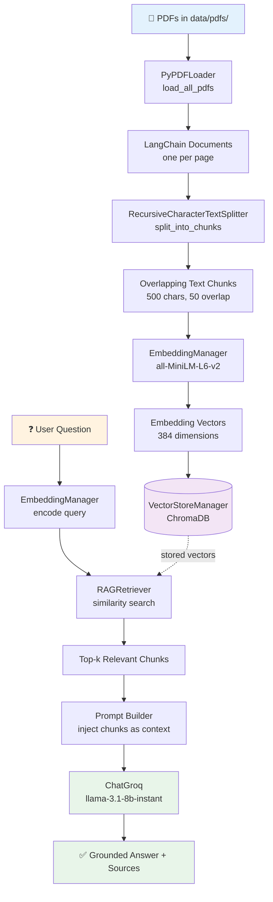
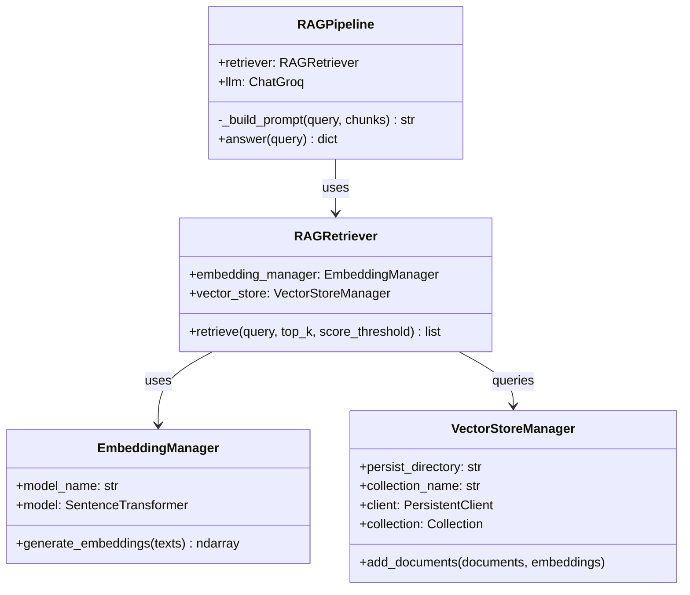

# 🔎 RAG Pipeline — PDF Question Answering System

A Retrieval-Augmented Generation (RAG) system built from scratch in a single notebook —
ask questions about your own PDFs and get grounded, context-aware answers from an LLM,
instead of hallucinated guesses.


---

## 📖 Overview

RAG (Retrieval-Augmented Generation) solves a core LLM limitation: models can't answer
questions about documents they were never trained on. This pipeline fixes that by:

1. Converting your PDFs into small, searchable chunks of meaning (embeddings)
2. Finding the chunks most relevant to a question (retrieval)
3. Feeding those chunks to an LLM as context so it answers **using your documents**, not memory (generation)

This project was built as a hands-on learning exercise to understand every stage of a
RAG system — no black-box frameworks, every step is implemented and explained.

---

## 🧭 Pipeline Architecture



**Two halves of the pipeline:**

| Phase | Steps | Purpose |
|---|---|---|
| 🗂️ **Ingestion** (run once) | Load → Split → Embed → Store | Turn PDFs into a searchable vector database |
| 💬 **Query** (run per question) | Embed query → Retrieve → Generate | Answer a question using the stored knowledge |

---

## 🏗️ Class Design



---

## 🧰 Tech Stack

| Component | Library | Why |
|---|---|---|
| PDF loading | `langchain-community` (`PyPDFLoader`) | Reliable page-by-page PDF parsing |
| Text splitting | `langchain-text-splitters` | Overlapping chunks preserve context across boundaries |
| Embeddings | `sentence-transformers` (`all-MiniLM-L6-v2`) | Fast, lightweight, runs locally — no API cost |
| Vector database | `chromadb` | Simple, persistent, no external server needed |
| LLM inference | `langchain-groq` (`llama-3.1-8b-instant`) | Free tier, very fast inference speed |

---

## 📁 Project Structure

```
RAG-pipeline/
├── RAG_pipeline_scratch.ipynb   # main notebook — run top to bottom
├── data/
│   ├── pdfs/                    # 👉 put your source PDFs here
│   └── vector_store/            # ChromaDB persists embeddings here (auto-created)
├── README.md
└── requirements.txt             # optional, see below
```

---

## 🚀 Setup & Usage

### 1. Clone / open the notebook
Open `RAG_pipeline_scratch.ipynb` in Google Colab or Jupyter.

### 2. Install dependencies
```bash
pip install langchain langchain-core langchain-community langchain-groq pypdf pymupdf sentence-transformers chromadb -q
```

### 3. Add your PDFs
Drop your PDF file(s) directly inside `data/pdfs/` — **not** in `data/` itself.

### 4. Get a free Groq API key
Grab one from [console.groq.com/keys](https://console.groq.com/keys). Copy it somewhere
safe as soon as it's created — Groq only shows the full key once.

### 5. Run all cells top to bottom
In Colab: **Runtime → Run all**. When prompted, paste your Groq API key (input stays hidden).

### 6. Ask a question
```python
result = rag_pipeline.answer("What is an encoder-decoder?")

print("ANSWER:\n", result["answer"])
print("\nSOURCES:", result["sources"])
```

**Example output:**
```
ANSWER:
 An encoder-decoder is a neural network architecture where the encoder
 compresses the input into a fixed representation, and the decoder
 generates the output sequence from that representation...

SOURCES: ['data/pdfs/research.pdf', 'data/pdfs/research.pdf']
```

---

## 🔑 Key Classes

- **`EmbeddingManager`** — loads the sentence-transformer model and converts text into embedding vectors.
- **`VectorStoreManager`** — wraps a persistent ChromaDB collection; handles storing and counting documents.
- **`RAGRetriever`** — embeds a query and pulls back the top-k most similar chunks from the vector store.
- **`RAGPipeline`** — combines retrieval with LLM generation to produce a final, source-grounded answer.

---

## 🛠️ Troubleshooting

| Symptom | Fix |
|---|---|
| `ModuleNotFoundError` | Install cell didn't finish, or kernel needs a restart after installing. Re-run `pip install`, restart runtime, run all cells again. |
| `PDFs loaded: 0` | PDF isn't inside `data/pdfs/`. Check it's not sitting in `data/` directly. |
| `ValueError: Expected Embeddings to be non-empty...` | No PDF pages were loaded. Re-run `load_all_pdfs()` → `split_into_chunks()` → ingestion cell, in that order, after fixing the PDF location. |
| Stuck on "Enter your Groq API key" | Not an error — paste your key and press Enter. Typing stays hidden for security. |

---

## 🔮 Possible Extensions

- Swap `ChatGroq` for OpenAI, Gemini, or a local model (Ollama) inside `RAGPipeline`
- Add a `score_threshold` tuning experiment to see how it affects answer quality
- Support multi-PDF source citation with page numbers
- Wrap the pipeline in a simple Streamlit chat UI

---

## 📄 License

This project is for educational purposes as part of an AI/ML learning portfolio.
